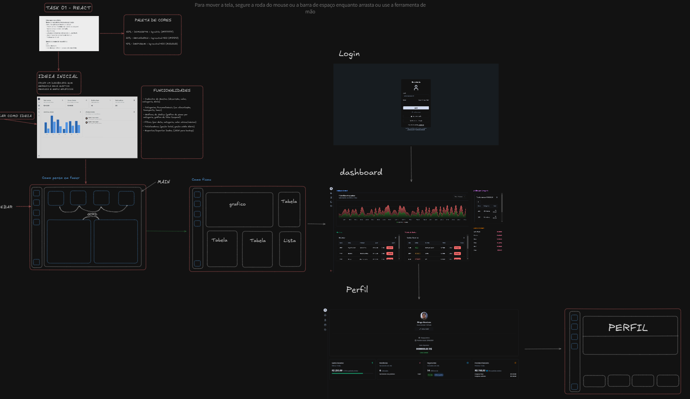

# 💰 Gerenciamento de Gastos

Este é um projeto para gerenciar gastos pessoais, permitindo que os usuários acompanhem suas despesas e receitas de forma eficiente.

## ✨ Funcionalidades

- ➕ Adicionar, ✏️ editar e ❌ excluir despesas
- 📅 Visualizar resumo mensal
- 🏷️ Categorizar despesas e receitas
- 📊 Gerar relatórios

## 🛠️ Tecnologias

- **Frontend**: Next.js 15.x (App Router)
- **Estilização**: Tailwind CSS


## Design do projeto
  
- https://excalidraw.com/#json=zkyPe9m49Z5A9S9mDrJty,19L64rGolr8qFzBD6XQE0Q


## 🚀 Instalação

1. Clone o repositório:
    ```bash
    git clone https://github.com/seu-usuario/gerenciamento-de-gastos.git
    ```
2. Navegue até o diretório do projeto:
    ```bash
    cd gerenciamento-de-gastos
    ```
3. Instale as dependências:
    ```bash
    npm install
    ```

5. Inicie a aplicação:
    ```bash
    npm run dev
    ```
